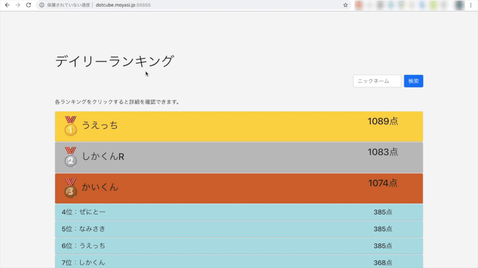

# Ollie Ranking

## Ollie Ranking

宮崎大学
dot cube
同好会が
清花祭（大学祭）で展示した体感型スケートボードゲーム
"Ollie"
のランキングシステムです。

このシステムは、大学祭での展示を前提に制作しました。

2018-12-09 現在
現在、本システムは停止中です。

### 機能
主に以下の4つの機能があります。

1. ランキング表示機能
2. スコアデータ受信機能
3. ニックネーム登録機能
4. スコア検索機能

#### 1. ランキング表示機能

クライアント（ゲーム）側から送信されてきたデータをソートし、ランキング圏内であればランキングに表示します。

各ランキングをクリックまたはタップすると、詳細情報を確認できます。（
iOS
端末での不具合を確認しています。）

#### 2. スコアデータ受信機能
GET
メソッドで、クライアント（ゲーム）側から送信されてきたデータを受信することができます。受信したデータはファイルに保存されます。

データ受信用の
URL
をハッシュ関数を使用したランダムな文字列とする事で、外部から不正なデータを送られる可能性を軽減しています。

#### 3. ニックネーム登録機能
あらかじめ設定された基準スコアを超えるとニックネームを登録することが出来ます。登録したニックネームはランキングに表示されます。

登録方法は、表示された
QR
コードの
URL
から登録できます。登録は一度しかできず、変更はできません。ニックネームの長さは最大
20
文字（半角・全角を問わない）です。

登録用のURLはそれぞれゲームデータと１対１に対応したユニークな
URL
となっておりユーザー登録などの必要はありません。

基準スコアを超えなかった場合、ニックネーム登録用の
URL
は発行されずニックネームの登録はできません。その場合ニックネームはあらかじめ設定されたニックネームで登録され、表示されます。

#### 4. スコア検索機能
ゲームのリザルト画面に表示されるエントリー番号または、登録したニックネームから自分のスコアを検索することが出来ます。

だたしニックネームでの検索の場合、ニックネームを正確に入力しないと検索できません。またエントリー番号から検索する際は、半角数字で入力してください。

## 実行環境

### 環境

* Python バージョン

    * Python 3.6.5

* 使用フレームワーク
    
    * Flask 1.0.2

* 使用モジュール

    * datetime
    * time
    * json
    * random
    * hashlib
    * qrcode

* 実行環境

    * OS: Ubuntu 18.04 LTS (Bionic Beaver)
    * Server: GCP Compute Engine g1-small（vCPU x 1
    、メモリ
     1.7 GB）

<!--
## 使用方法

## 言い訳

## Licence

## 開発者

## 参考文献
-->

